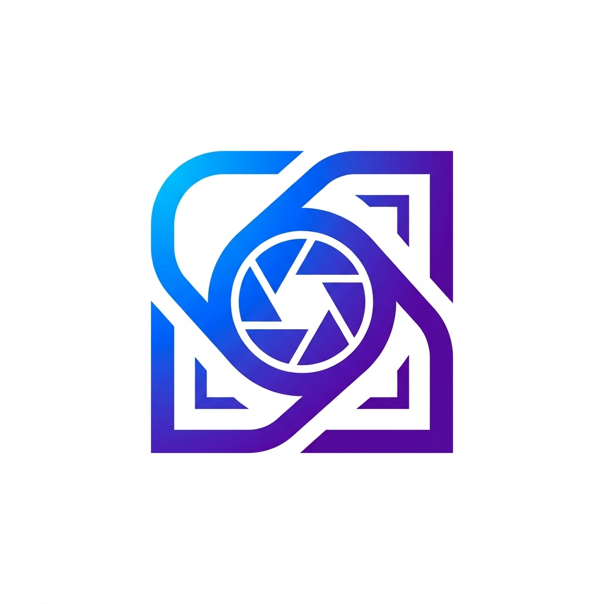
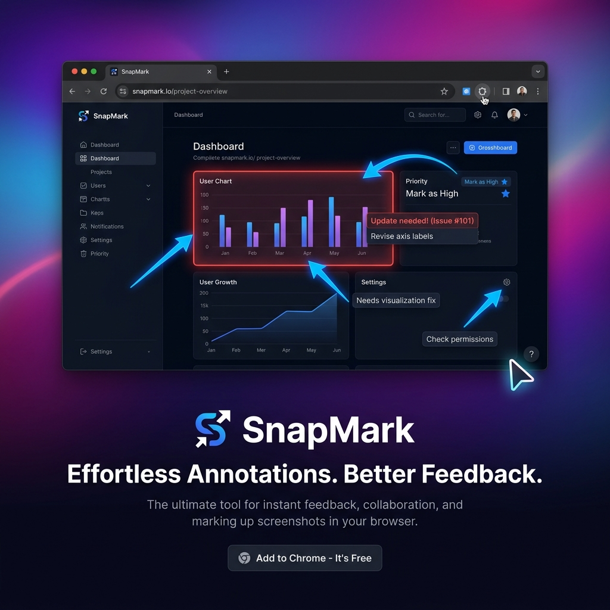
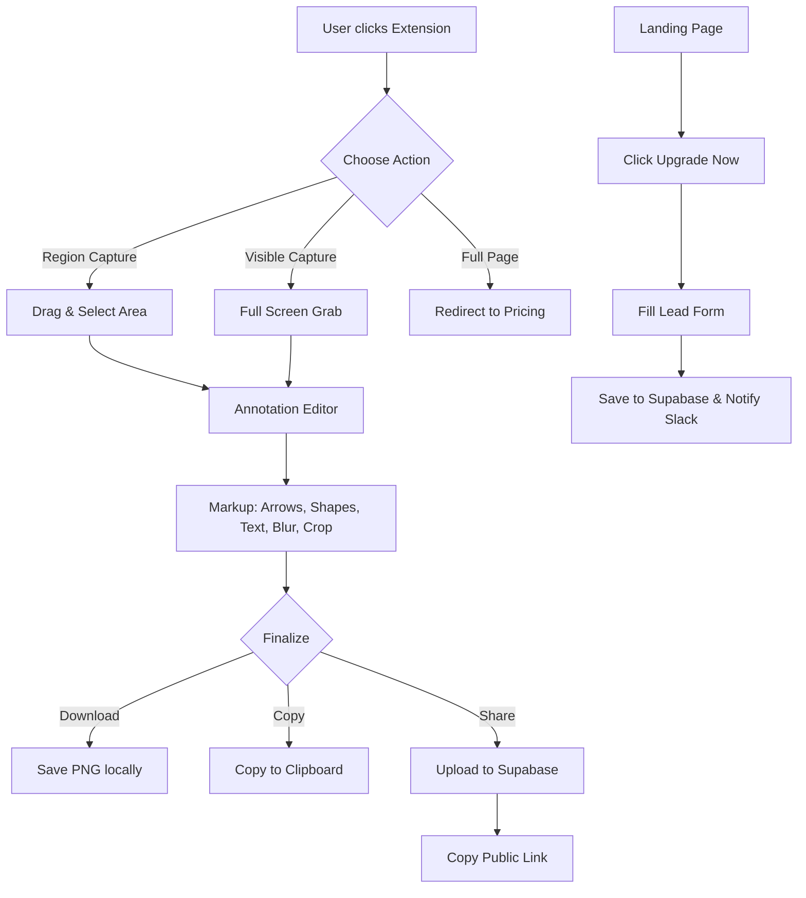
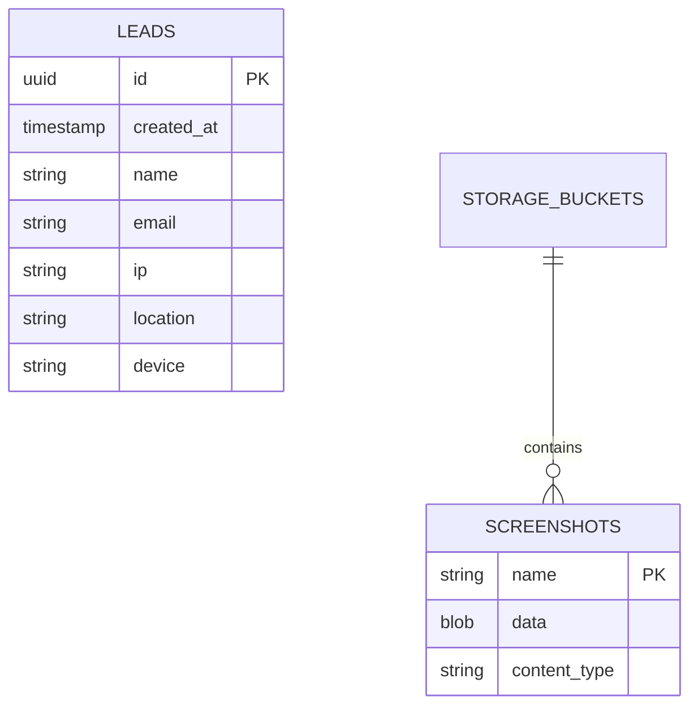

  

# SnapMark: Pro Screenshot & Markup Suite 🚀

SnapMark is a high-performance, privacy-first Chrome extension for capturing, annotating, and sharing screenshots instantly. Built for developers, designers, and product managers who need to communicate visually at the speed of thought.

## 🌐 Live Presence
- **Landing Page**: [snapmark.brilworks.com](https://snapmark.brilworks.com)
- **GitHub**: [github.com/Brilworks-Software/snapmark](https://github.com/Brilworks-Software/snapmark)

---

## 🗺️ User Flow

---

## 🏗️ Architecture & Component Flow

SnapMark follows a modular architecture using Manifest V3 and Vercel Serverless:

- **Frontend (Extension)**: 
    - `popup/`: User entry point.
    - `content/`: Selection overlay injection.
    - `background/`: Core logic and image processing (OffscreenCanvas).
    - `editor/`: Advanced canvas-based annotation engine.
- **Backend (Cloud)**:
    - **Supabase Storage**: Hosts public screenshots.
    - **Vercel API**: Securely handles Pro leads and Slack integrations.
    - **Slack API**: Instant notifications for business intelligence.

---

## 📊 Database Schema (ER Diagram)

---

## 🛠️ Tech Stack

- **Extension**: Vanilla JavaScript, HTML5 Canvas API, Chrome Extension API (MV3).
- **Backend**: Supabase (Storage & DB), Vercel Serverless Functions (Node.js).
- **Styling**: Vanilla CSS3 (Custom Glassmorphism Design).
- **Integrations**: Slack Webhooks, IPAPI for Geolocation.

---

## 🚀 Deployment & Configuration

### Prerequisites
1. **Supabase**: Create a project and a public bucket named `screenshots`.
2. **Slack**: Create an App and get an OAuth token with `chat:write` permissions.
3. **Vercel**: Link your GitHub repo and set the following environment variables:
   - `SLACK_TOKEN`
   - `SLACK_CHANNEL_ID`
   - `SUPABASE_URL`
   - `SUPABASE_ANON_KEY`

### Local Setup
1. Clone the repo.
2. Copy `editor/supabase-config.example.js` to `editor/supabase-config.js` and add your keys.
3. Load the root folder in Chrome via **Load Unpacked**.

---

## 🛡️ Security & Privacy
- **No Third-Party Analytics**: We don't track your behavior.
- **Local-First**: Annotations are processed entirely on your machine.
- **Secure API**: All business logic and tokens are handled on the server-side via Vercel.

---

Built with ❤️ by [Brilworks](https://brilworks.com)
